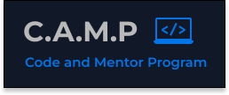

# Hi There!

My name is Justin Morrison and I am a 3rd year Software Engineering Student at Carleton University.

I made this project in response to the defunding other student support programs at Carleton that I personally used and know other students found quite helpful. This project is only focused on supporting ***SYSC1006: Introduction to Imperative Programming*** 

The project is still in development and right now this is mostly a skeleton. I still have to add most of the lecture notes, and then add more exercises and a comprehensive mock midterm/final exam. There are also some visual bugs that still need to be fixed. 

Here is a [link](https://justin-morrison-github.github.io/SYSC-1006-2006/) to the webpage at the moment: 

My plan right now is to provide:
- Condensed notes on each lesson, focusing on important pieces
- Practice on each of the concepts which will take form as:
    - End of lecture note quizzes which are included alongside the notes
    - Exercise questions of varying difficulty  
    - Mock midterms/finals for sense of a real examination

I have to give credit to Dr Lynn Marshall and Dr Ruiz Martin from Carleton University. I have structured the content of this project around the slides they created for this course when I took it.